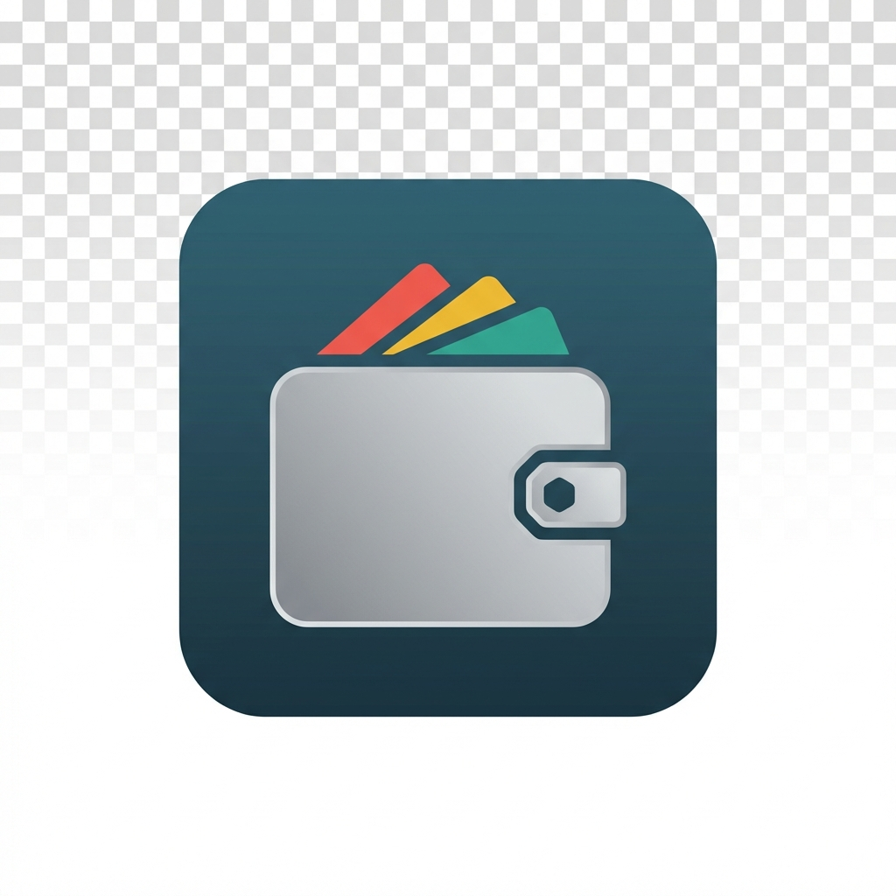

<p align="center">
  
</p>

<h1 align="center">💰 TrackExpense</h1>

<p align="center">
  <strong>Your Personal Finance Companion 📊</strong>
</p>

<p align="center">
  <em>A modern, feature-rich Android application to effortlessly track your income, expenses, and budgets with beautiful analytics and insights.</em>
</p>

<p align="center">
  <a href="#-features">Features</a> •
  <a href="#-tech-stack">Tech Stack</a> •
  <a href="#-installation">Installation</a> •
  <a href="#-screenshots">Screenshots</a> •
  <a href="#-contributing">Contributing</a> •
  <a href="#-license">License</a>
</p>

<p align="center">
  
  
  
  
</p>

---

## 📱 About The App

**TrackExpense** is a comprehensive personal finance management application designed to help you take complete control of your money. With an intuitive interface, powerful features, and beautiful visualizations, managing your daily expenses and income has never been easier.

Whether you're tracking daily coffee purchases ☕ or planning your monthly budget 📅, TrackExpense has got you covered!

---

## ✨ Features

### 🔐 Authentication & Security
| Feature | Description |
|---------|-------------|
| 📧 Email/Password Login | Secure Firebase Authentication |
| 🔑 Google Sign-In | One-tap OAuth integration |
| ✉️ Email Verification | Mandatory account verification |
| 👤 Guest Mode | Explore without registration (5 transactions/day) |
| 🔄 Password Recovery | Email-based reset link |
| 🛡️ Secure Sessions | Token-based session management |

### 🏠 Dashboard
| Feature | Description |
|---------|-------------|
| 💵 Financial Overview | Real-time Balance, Income & Expenses |
| 📊 Budget Card | Progress tracking with visual indicators |
| 📋 Recent Transactions | Quick view with filter options |
| 👋 Personalized Greeting | Time-based welcome messages |
| 🎴 Animated Card Flip | Beautiful 3D flip animations |

### 💰 Transaction Management
| Feature | Description |
|---------|-------------|
| ➕ Add Income & Expenses | Categorized transaction entry |
| ⚡ Quick Amount Chips | Fast entry with preset amounts |
| 🏷️ Category Selection | 20+ beautiful categories with icons |
| 📅 Date Picker | Material Design date selection |
| ✏️ Edit & Delete | Swipe gestures for quick actions |
| 🔍 Search & Filter | By type, date range, and category |
| ⚠️ Budget Warnings | Alerts when approaching limits |

### 📊 Analytics & Reports
| Feature | Description |
|---------|-------------|
| 🥧 Pie Charts | Visual expense breakdown by category |
| 📈 Bar Charts | Income vs Expense comparison |
| 📉 Progress Bars | Category-wise spending indicators |
| 🔢 Statistics Cards | Transaction count, averages, maximums |
| ⏰ Time Filters | Week, Month, Year, All Time views |

### 🔔 Notifications
| Feature | Description |
|---------|-------------|
| 📬 In-App Panel | Slide-in notification center |
| 🔴 Unread Badge | Real-time notification count |
| ✅ Bulk Actions | Mark all read, clear all |
| 🚨 Budget Alerts | Warning at 90%, exceeded notifications |
| 📝 Category Updates | Request status notifications |

### 👤 Profile & Settings
| Feature | Description |
|---------|-------------|
| ✏️ Editable Profile | Display name and avatar |
| 💱 Currency Selection | BDT, USD, EUR, GBP, INR |
| 🌓 Theme Modes | Light, Dark, System Default |
| 💸 Budget Configuration | Monthly limits with presets |
| 🚪 Account Management | Logout, Delete Account |

### 📁 Data Management
| Feature | Description |
|---------|-------------|
| 📤 Export Data | CSV and JSON formats |
| 📥 Import Data | Restore from backup files |
| ☁️ Cloud Sync | Real-time Firebase sync |
| 📴 Offline Support | Full functionality without internet |
| 🔄 Guest Migration | Transfer data on registration |

### 👨‍💼 Admin Panel
| Feature | Description |
|---------|-------------|
| 👥 User Management | View and manage all users |
| 📂 Category Management | Add, edit, delete categories |
| 📋 Request System | Approve/reject user requests |
| 📊 Transaction Oversight | System-wide transaction view |

### 🎨 Beautiful UI/UX
| Feature | Description |
|---------|-------------|
| 🎭 Material Design 3 | Modern Android components |
| 💀 Skeleton Loading | Smooth loading placeholders |
| ✨ Animations | Card flips, slides, counters |
| 📱 Responsive Design | Adapts to all screen sizes |
| 🍞 Custom Toasts | Beautiful notification messages |

---

## 🛠️ Tech Stack

<table>
<tr>
<td align="center"><strong>🔧 Component</strong></td>
<td align="center"><strong>🚀 Technology</strong></td>
</tr>
<tr><td>📝 Language</td><td>Java</td></tr>
<tr><td>📱 Platform</td><td>Android (API 24 - 34)</td></tr>
<tr><td>🏗️ Architecture</td><td>MVVM (Model-View-ViewModel)</td></tr>
<tr><td>🎨 UI Framework</td><td>XML Layouts + Material Design 3</td></tr>
<tr><td>💾 Local Database</td><td>Room Persistence Library</td></tr>
<tr><td>☁️ Cloud Database</td><td>Firebase Firestore</td></tr>
<tr><td>🔐 Authentication</td><td>Firebase Auth (Email + Google)</td></tr>
<tr><td>📊 Charts</td><td>MPAndroidChart</td></tr>
<tr><td>🧭 Navigation</td><td>Android Jetpack Navigation</td></tr>
<tr><td>⚙️ Background Tasks</td><td>WorkManager</td></tr>
<tr><td>🔔 Notifications</td><td>FCM + Local Notifications</td></tr>
</table>

---

## 📋 Requirements

### 📱 Minimum Requirements
- **Android Version:** 7.0 (Nougat) or higher
- **API Level:** 24+
- **Storage:** ~50 MB
- **Internet:** Required for cloud sync (optional for offline mode)

### 💻 Development Requirements
- **Android Studio:** Arctic Fox or later
- **JDK:** 11 or higher
- **Gradle:** 8.0+
- **Firebase Project:** With Auth and Firestore enabled

---

## 🚀 Installation

### 📥 Clone the Repository
```bash
git clone https://github.com/nNEWBE/expense-tracker.git
cd expense-tracker
```

### 🔧 Configure Firebase
1. Create a project at [Firebase Console](https://console.firebase.google.com) 🔥
2. Download `google-services.json` and place in `app/` folder
3. Enable Email/Password and Google Sign-In authentication
4. Create a Firestore database

### 🏃 Build and Run
```bash
./gradlew assembleDebug
```

---

## 📂 Project Structure

```
📦 app/src/main/java/com/example/trackexpense/
├── 📄 MainActivity.java          # Main entry point
├── 📁 adapters/                   # RecyclerView Adapters
├── 📁 data/
│   ├── 📁 local/                  # Room Database
│   ├── 📁 model/                  # Data Models
│   ├── 📁 remote/                 # Firebase Services
│   └── 📁 repository/             # Data Repositories
├── 📁 ui/
│   ├── 📁 admin/                  # Admin Panel
│   ├── 📁 analytics/              # Charts & Reports
│   ├── 📁 auth/                   # Login & Register
│   ├── 📁 dashboard/              # Home Dashboard
│   ├── 📁 expense/                # Transaction Screens
│   ├── 📁 profile/                # User Profile
│   └── 📁 splash/                 # Splash Screen
├── 📁 utils/                      # Utility Classes
└── 📁 viewmodel/                  # ViewModels
```

---

## 📸 Screenshots

| 🏠 Dashboard | 💳 Transactions | 📊 Analytics |
|:------------:|:---------------:|:------------:|
| Home overview with balance | Transaction list with filters | Charts and statistics |

| 👤 Profile | 🔔 Notifications | 👨‍💼 Admin Panel |
|:----------:|:----------------:|:--------------:|
| User settings | In-app alerts | Category management |

---

## 🌟 Future Roadmap

| Feature | Status |
|---------|--------|
| 🧠 AI-Powered Insights | 🔜 Planned |
| 📅 Recurring Transactions | 🔜 Planned |
| 🤝 Shared Wallets | 🔜 Planned |
| 📱 Home Screen Widgets | 🔜 Planned |
| 🔒 Biometric Authentication | 🔜 Planned |
| 🌍 Multi-Language Support | 🔜 Planned |
| 📄 Receipt Scanning (OCR) | 🔜 Planned |

---

## 🤝 Contributing

Contributions are what make the open source community amazing! Any contributions you make are **greatly appreciated** 🙏

1. 🍴 Fork the Project
2. 🌿 Create your Feature Branch (`git checkout -b feature/AmazingFeature`)
3. 💾 Commit your Changes (`git commit -m 'Add some AmazingFeature'`)
4. 📤 Push to the Branch (`git push origin feature/AmazingFeature`)
5. 🔃 Open a Pull Request

---

## 📄 License

Distributed under the **MIT License**. See `LICENSE` for more information.

---

## 👨‍💻 Author

<p align="center">
  <strong>👤 Shuvo</strong>
</p>

<p align="center">
  Made with ❤️ and ☕ for better financial management
</p>

---

<p align="center">
  ⭐ <strong>Star this repository if you find it helpful!</strong> ⭐
</p>

<p align="center">
  <a href="https://github.com/nNEWBE/expense-tracker/issues">🐛 Report Bug</a> •
  <a href="https://github.com/nNEWBE/expense-tracker/issues">💡 Request Feature</a>
</p>
