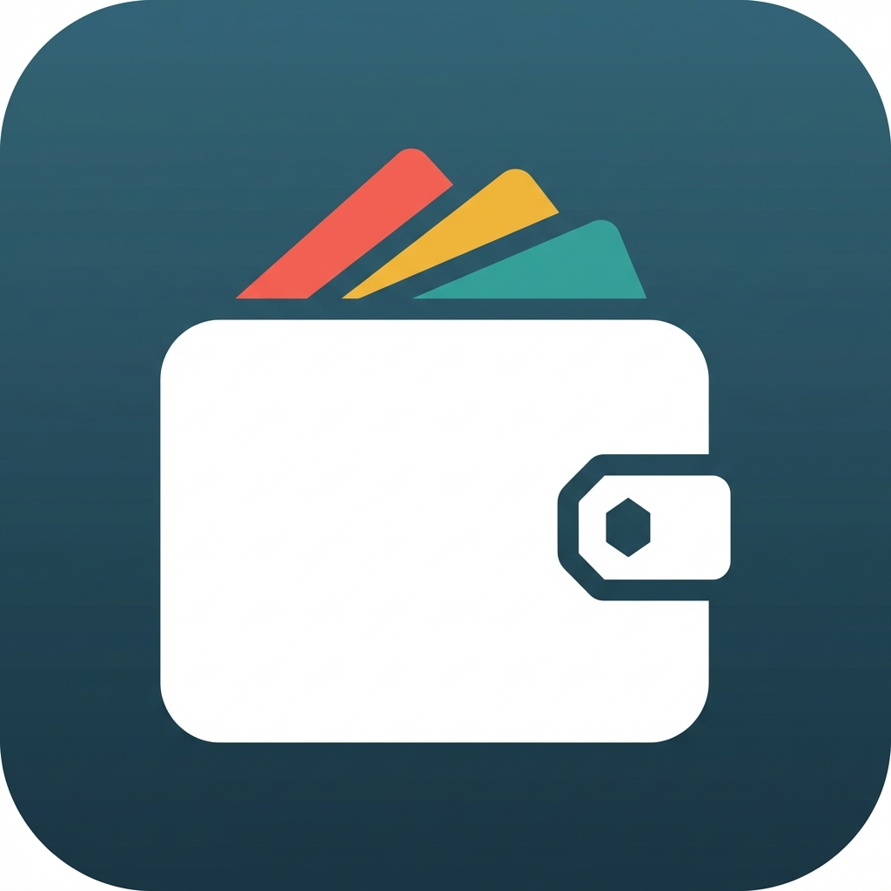

<p align="center">
  
</p>

<h1 align="center">TrackExpense</h1>
<p align="center">
  <strong>Your Personal Finance Companion</strong>
</p>
<p align="center">
  A modern, feature-rich Android application to track your income, expenses, and budgets with beautiful analytics.
</p>

---

## 📱 About The App

**TrackExpense** is a comprehensive personal finance management application designed to help you take control of your money. With an intuitive interface and powerful features, it makes tracking your daily expenses and income effortless.

---

## ✨ Key Features

### 🔐 Authentication & Security
- **Email/Password Login** with Firebase Authentication
- **Google Sign-In** for quick access
- **Email Verification** for account security
- **Guest Mode** - Explore the app without registration (limited to 5 transactions/day)
- **Password Recovery** via email reset link
- **Secure Session Management**

### 🏠 Dashboard
- **Real-time Financial Overview** - Total Balance, Income & Expenses
- **Monthly Budget Card** with progress tracking
- **Recent Transactions** with filter options
- **Time-based Personalized Greeting**
- **Animated Card Flip** between balance and budget views

### 💰 Transaction Management
- **Add Income & Expenses** with categorization
- **Quick Amount Chips** for fast entry (৳100, ৳500, ৳1000, ৳5000)
- **Category Selection** with beautiful icons and colors
- **Date Picker** for backdated entries
- **Edit & Delete** with swipe gestures
- **Search & Filter** by type, date range, and category
- **Budget Warnings** when approaching or exceeding limits

### 📊 Analytics & Reports
- **Pie Charts** - Visual expense breakdown by category
- **Bar Charts** - Income vs Expense comparison
- **Category Progress Bars** with color indicators
- **Statistics Cards** - Transaction count, averages, highest amounts
- **Time Period Filters** - Week, Month, Year, All Time

### 🔔 Notifications
- **In-App Notification Panel** with slide-in animation
- **Transaction Alerts** - Created, Updated, Deleted
- **Budget Alerts** - Warning at 90%, Exceeded notifications
- **Category Request Status** updates
- **Mark All Read** and bulk actions

### 👤 Profile & Settings
- **Editable Display Name** and profile avatar
- **Currency Selection** - BDT, USD, EUR, GBP, INR
- **Theme Modes** - Light, Dark, System Default
- **Budget Configuration** with quick presets
- **Account Management** - Logout, Delete Account

### 📁 Data Management
- **Export Data** as CSV or JSON files
- **Import Data** from external files
- **Cloud Sync** with Firebase Firestore
- **Offline Support** - Full functionality without internet
- **Guest Data Migration** when registering

### 👨‍💼 Admin Panel
- **User Management** - View and manage all users
- **Category Management** - Add, edit, delete categories
- **Category Request System** - Approve/reject user requests
- **Transaction Oversight** - View all system transactions

### 🎨 Beautiful UI/UX
- **Material Design 3** components
- **Skeleton Loading** states
- **Smooth Animations** - Card flips, panel slides, counters
- **Responsive Design** for all screen sizes
- **Custom Toast Notifications** with icons

---

## 🛠️ Tech Stack

| Component | Technology |
|-----------|------------|
| **Language** | Java |
| **Platform** | Android (API 24 - 34) |
| **Architecture** | MVVM (Model-View-ViewModel) |
| **UI Framework** | XML Layouts + Material Design 3 |
| **Local Database** | Room Persistence Library |
| **Cloud Database** | Firebase Firestore |
| **Authentication** | Firebase Auth (Email + Google) |
| **Charts** | MPAndroidChart |
| **Navigation** | Android Jetpack Navigation |
| **Background Tasks** | WorkManager |
| **Notifications** | Firebase Cloud Messaging + Local |

---

## 📋 Requirements

### Minimum Requirements
- **Android Version**: 7.0 (Nougat) or higher
- **API Level**: 24+
- **Storage**: ~50 MB
- **Internet**: Required for cloud sync (optional for offline mode)

### Development Requirements
- **Android Studio**: Arctic Fox or later
- **JDK**: 11 or higher
- **Gradle**: 8.0+
- **Firebase Project** with Authentication and Firestore enabled

---

## 🚀 Getting Started

### Installation

1. **Clone the repository**
   ```bash
   git clone https://github.com/nNEWBE/expense-tracker.git
   ```

2. **Open in Android Studio**
   - File → Open → Select the project folder

3. **Configure Firebase**
   - Create a Firebase project at [Firebase Console](https://console.firebase.google.com)
   - Download `google-services.json` and place it in the `app/` folder
   - Enable Email/Password and Google Sign-In authentication
   - Create a Firestore database

4. **Build and Run**
   ```bash
   ./gradlew assembleDebug
   ```

---

## 📂 Project Structure

```
app/src/main/java/com/example/trackexpense/
├── MainActivity.java              # Main entry point
├── adapters/                      # RecyclerView Adapters
├── data/
│   ├── local/                     # Room Database
│   ├── model/                     # Data Models
│   ├── remote/                    # Firebase Services
│   └── repository/                # Data Repositories
├── ui/
│   ├── admin/                     # Admin Panel
│   ├── analytics/                 # Charts & Reports
│   ├── auth/                      # Login & Register
│   ├── dashboard/                 # Home Dashboard
│   ├── expense/                   # Transaction Screens
│   ├── profile/                   # User Profile
│   └── splash/                    # Splash Screen
├── utils/                         # Utility Classes
└── viewmodel/                     # ViewModels
```

---

## 📸 Screenshots

| Dashboard | Transactions | Analytics |
|-----------|--------------|-----------|
| Home overview with balance | Transaction list with filters | Charts and statistics |

| Profile | Notifications | Admin Panel |
|---------|---------------|-------------|
| User settings | In-app alerts | Category management |

---

## 🌟 Future Enhancements

- 🧠 **AI-Powered Insights** - Smart spending predictions
- 📅 **Recurring Transactions** - Automated entries
- 🤝 **Shared Wallets** - Family/group expense tracking
- 📱 **Home Screen Widgets** - Quick access
- 🔒 **Biometric Authentication** - Fingerprint/Face unlock
- 🌍 **Multi-Language Support** - Global localization
- 📄 **Receipt Scanning** - OCR for auto-entry

---

## 🤝 Contributing

Contributions are welcome! Please feel free to submit a Pull Request.

1. Fork the project
2. Create your feature branch (`git checkout -b feature/AmazingFeature`)
3. Commit your changes (`git commit -m 'Add some AmazingFeature'`)
4. Push to the branch (`git push origin feature/AmazingFeature`)
5. Open a Pull Request

---

## 📄 License

This project is licensed under the MIT License - see the [LICENSE](LICENSE) file for details.

---

## 👨‍💻 Author

<p align="center">
  <strong>Shuvo</strong>
</p>
<p align="center">
  Made with ❤️ for better financial management
</p>

---

<p align="center">
  ⭐ Star this repository if you find it helpful!
</p>
